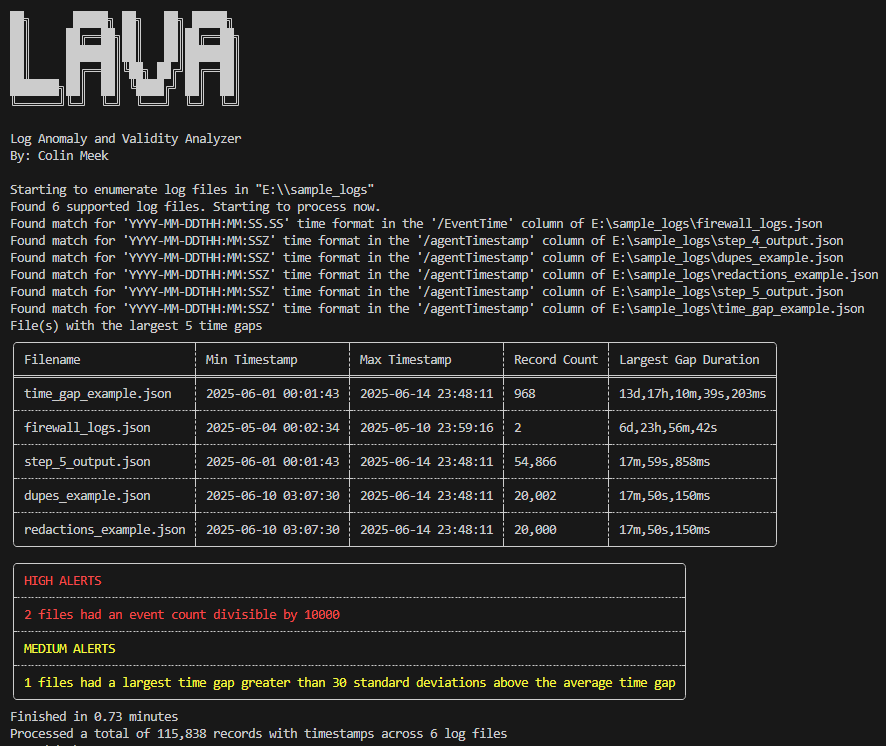

# Log Anomaly and Validity Analyzer (LAVA)

First released July of 2025

## About

LAVA parses a variety of log types, generates statistics about provided log files and alerts on common issues within. 

Useful statistics include:
- Minimum Timestamp
- Maximum Timestamp
- Number of Records
- Largest Time Gap
- Duplicate Records
- Potential Redactions

## Terminal Output

Note: More in depth statistics are written to a CSV in the output directory

## Supported Log Files
- CSV
    - LAVA attempts to handle CSVs where there is garbage data above the header row, although this is not guaranteed to work in all cases. You may need to manually fix the CSV before processing.
- JSONL (New Line Separated JSON)
- Unstructured, plaintext log files
    - Since many log files are simply new line separated plain text, LAVA attempts to handle these formats as well. Because of the unstructured nature of many plaintext logs, results may be unreliable. 
- Windows XML EventLog (EVTX)
  - Lava has native support for binary windows event log files. Since windows event logs often have out of order records, this type bypasses the chronology checks that all plaintext records go through. This may produce unreliable results on live systems.

## Assumptions
- Plaintext input files are sorted based on time

## Command Line Arguments
  `-i, --input <PATH>`

  Input log file or directory. If a single log file is provided, the one file will be processed.  If a directory is provided, all log files within the directory will be recusively processed.
  
  `-o, --output <PATH>`   
  
  Directory to output files to. If a directory is not provided, LAVA will create a "LAVA_Output" directory in the directory of execution.

  `-r, --regexes <PATH>`

  YML file with custom timestamp formats to use. Below is an example of what to put in the YML file. **Make sure to escape any backslashes in this file** (common in regexes).
  ```
  - pretty_format: "Mon D, YYYY h:MM:SS AM/PM"
    regex: "[A-Za-z]{3} \\d{1,2}, \\d{4} \\d{1,2}:\\d{2}:\\d{2} [AP]M"
    strftime_format: "%b %e, %Y %l:%M:%S %p"
  ```

  `-p, --printregexes`
  
  Print the timestamp formats which the exe was compiled with. This is the format of the YML file that you can pass custom formats with `-r` **besides the escaped backlashes**.

  `-t, --tf <PATH>`
  
  Timestamp field to use for time analysis. For CSVs this is just the header, and for JSONL it is the key. If the timestamp field is a nested key, use "->" to use the nested key.

  `-q, --quick`
  
  Quick mode. Skips file hashing, duplicate detection, and redaction detection which are all expensive.

  `-m, --multipart`
  
  Multipart mode. Treats all input files as chunks of the same log. Will combine statistics (Count, Mean, Standard Deviation), add in the time gaps between the logs, and regenerate alerts. Will also alert on overlapping log files.

  `-v, --verbose`
  
  Verbose mode.
  
  `-h, --help`
  
  Print help menu.

## Date Regexes

For timestamp analysis, LAVA relies on pairs of regex and strftime format strings. The regex is used to capture the timestamp string from the logs, and the strftime format is used to parse it into a NaiveDateTime object. These pairs are exposed in the yml file at `build_yml_files/dates.yml`, and are built into the executable at compile time. An example of the format needed in that file are below 
```
- pretty_format: "YYYY-MM-DDTHH:MM:SSZ"
  regex: "\\d{4}-\\d{2}-\\d{2}T\\d{2}:\\d{2}:\\d{2}(?:\\.\\d{1,6})?Z"
  strftime_format: "%Y-%m-%dT%H:%M:%S%.fZ"
  should_match:
    - "2023-01-01T01:00:00.000000Z==2023-01-01T01:00:00Z"
    - "2023-01-01T01:00:00.000Z==2023-01-01T01:00:00Z"
    - "2023-01-01T01:00:00Z==2023-01-01T01:00:00Z"
  should_not_match:
    - "2023-01-01T01:00:00==2023-01-01T01:00:00Z"
    - "2023-01-01 01:00:00.000000Z==2023-01-01T01:00:00Z"
```
`pretty_format` - Just a human readable representation of the timestamp (Not used for any parsing)

`regex` - Regex to capture the timestamp. (backslashes must be escaped in the YML file)

`stftime_format` - Format to parse the thing string that is captured. Must follow the formats in https://docs.rs/chrono/latest/chrono/format/strftime/

`function_to_call` - **Optional** - String that references a function name in `date_string_mutations.rs`. This specifies the function that will be called on the captured string, before it is parsed into a datetime object with the specified strftime string. This is necessary for some time formats like Epoch milliseconds, and in the future, Syslog events with no year. Basically any format where the timestamp string on it's own, does not have a valid rust strftime format to parse it. As such you need something to mutate the string so that it can parse properly.

`should_match` - List of strings that follow the pattern `<raw string to parse>==<expected ISO 8601 timestamp>`. Each string will be used to generate a test, where the string on the left side of the `==` should get captured by the regex, successfully parsed by the strftime format, and match the time specified in the ISO format on the right of the `==`. If any part of this process fails, the test will fail.

`should_not_match` - List of strings that should fail one of conditions needed for should_match. 

## Design Decisions
- If a file is is out of order at any point, the time processing will halt, and any time related statistics that file will be disregarded (min/max time, largest time gap, number of time records). The file will still continue to be processed for duplicates and redactions as long as quick mode is not enabled. 
- If the first line of JSONL is not formatted properly, LAVA will alert on that fact, but not attempt to parse the file. If the first few lines are formatted properly (enough to determine the timestamp format, and direction), but a line farther into the file is not formatted properly, LAVA will alert on this fact every line, but attempt to continue parsing with the previously determined timestamp format and direction.
- Multipart mode does NOT look for duplicate records across files. Duplicate detection still happens on a per file basis.
- If timestamps in the input log file (such as syslog entries) do not include a year, LAVA assigns a default year of 1970 to all timestamps. Consequently, if the log file spans multiple years, timestamp parsing will fail because it interprets the timestamps as being out of chronological order.

## Compiling Tips
To assist in this process I wrote a powershell script at build.ps1 that will compile the tool for windows and linux. The `-increment` command line will increment the version number, and the `-publish` command line arg will publish a github release with the resulting executables. For the publish functionality you must install the github CLI `https://cli.github.com/`

### Manual Steps
Building for the local architecture is very easy, just run `cargo build --release`

To cross compile for linux / any other architecture, follow the steps below
1. Install and have docker running on your system
2. Use cargo to install cross with `cargo install cross`
3. Add the profile that you want to compile to rust `rustup target add x86_64-unknown-linux-gnu`. (List available targets with `rustup target list`)
4. Compile with `cross build --target x86_64-unknown-linux-gnu --release`


## Disclaimer

Although not guaranteed, the author of this project will attempt to fix critical issues and respond to pull requests in a timely manor. Use at your own risk and do not solely depend on output of this tool when it comes to legal forensic findings.