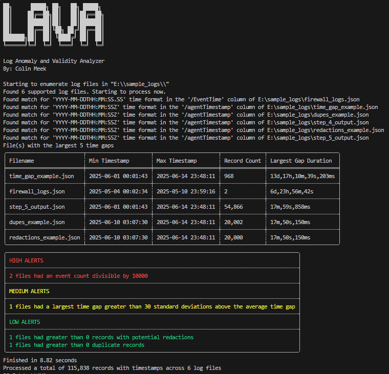

# Log Anomaly and Validity Analyzer (LAVA)

First released July of 2025

## About

LAVA parses a variety of log types, generates statistics about provided log files and alerts on common issues within. 

Useful statistics include:
- Minimum Timestamp
- Maximum Timestamp
- Number of Records
- Largest Time Gap
- Duplicate Records
- Potential Redactions

## Terminal Output

Note: More in depth statistics are written to a CSV in the output directory

## Supported Log Files
- CSV
    - LAVA attempts to handle CSVs where there is garbage data above the header row, although this is not guaranteed to work in all cases. You may need to manually fix the CSV before processing.
- JSONL (New Line Separated JSON)
- Unstructured, plaintext log files
    - Since many log files are simply new line separated plain text, LAVA attempts to handle these formats as well. Because of the unstructured nature of many plaintext logs, results may be unreliable. 
## Assumptions
- Input files are sorted based on time

## Command Line Arguments
  `-i, --input <PATH>`

  Input log file or directory. If a single log file is provided, the one file will be processed.  If a directory is provided, all log files within the directory will be recusively processed.
  
  `-o, --output <PATH>`   
  
  Directory to output files to. If a directory is not provided, LAVA will create a "LAVA_Output" directory in the directory of execution.

  `-r, --regexes <PATH>`

  YML file with custom timestamp formats to use. Below is an example of what to put in the YML file. **Make sure to escape any backslashes in this file** (common in regexes).
  ```
  - pretty_format: "Mon D, YYYY h:MM:SS AM/PM"
    regex: "[A-Za-z]{3} \\d{1,2}, \\d{4} \\d{1,2}:\\d{2}:\\d{2} [AP]M"
    strftime_format: "%b %e, %Y %l:%M:%S %p"
  ```

  `-p, --printregexes`
  
  Print the timestamp formats which the exe was compiled with. This is the format of the YML file that you can pass custom formats with `-r` **besides the escaped backlashes**.

  `-t, --tf <PATH>`
  
  Timestamp field to use for time analysis. For CSVs this is just the header, and for JSONL it is the key. If the timestamp field is a nested key, use "->" to use the nested key.

  `-q, --quick`
  
  Quick mode. Skips file hashing, duplicate detection, and redaction detection which are all expensive.

  `-v, --verbose`
  
  Verbose mode.
  
  `-h, --help`
  
  Print help menu.

## Date Regexes

For timestamp analysis, LAVA relies on pairs of regex and strftime format strings. The regex is used to capture the timestamp string from the logs, and the strftime format is used to parse it into a NaiveDateTime object. These pairs are exposed in the yml file at `build_yml_files/dates.yml`, and are built into the executable at compile time. An example of the format needed in that file are below 
```
- pretty_format: "YYYY-MM-DDTHH:MM:SSZ"
  regex: "\\d{4}-\\d{2}-\\d{2}T\\d{2}:\\d{2}:\\d{2}(?:\\.\\d{1,6})?Z"
  strftime_format: "%Y-%m-%dT%H:%M:%S%.fZ"
  should_match:
    - "2023-01-01T01:00:00.000000Z"
    - "2023-01-01T01:00:00.000Z"
    - "2023-01-01T01:00:00Z"
  should_not_match:
    - "2023-01-01T01:00:00"
    - "2023-01-01 01:00:00.000000Z"
```
`pretty_format` - Just a human readable representation of the timestamp (Not used for any parsing)

`regex` - regex to capture the timestamp

`stftime_format` - format to parse the thing string that is captured. Must follow the formats in https://docs.rs/chrono/latest/chrono/format/strftime/

`should_match` - List of strings that should get captured by the regex, successfully parsed by the strftime format, and **match the date January 1st, 2023, at 1 AM**. A test is auto generated for each of these, and if any one of those conditions fail, the test will fail.

`should_not_match` - List of strings that should fail one of conditions needed for should_match. 

## Design Decisions
- If a file is is out of order at any point, the time processing will halt, and the "number of records processed for time analysis" will be set to 0 for that file. The file will still continue to be processed for duplicates and redactions as long as quick mode is not enabled. 

## Compiling Tips
Building for the local architecture is very easy, just run `cargo build --release`
Follow the steps below to cross compile for linux / any other architecture
1. Install and have docker running on your system
2. Use cargo to install cross with `cargo install cross`
3. Add the profile that you want to compile to rust `rustup target add x86_64-unknown-linux-gnu`
4. compile with `cross build --target x86_64-unknown-linux-gnu --release`


## Disclaimer

Although not guaranteed, the author of this project will attempt to fix critical issues and respond to pull requests in a timely manor. Use at your own risk and do not solely depend on output of this tool when it comes to legal forensic findings.